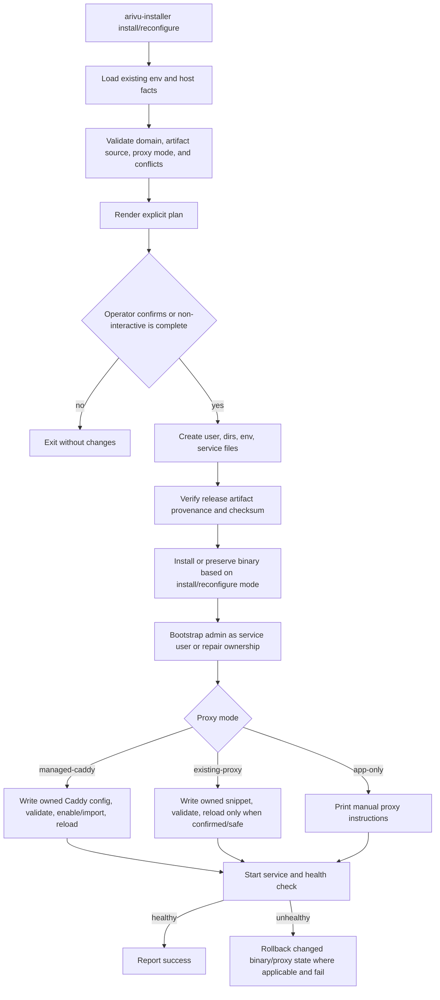

# Installer Review Findings Repair Plan

## Goal Capsule

Repair the installer review findings without removing current functionality or weakening the original self-hosting goal. The target outcome is an installer that can honestly complete an end-to-end Arivu install on clean VPS hosts, remains conservative on shared VPS hosts, and keeps Admin Settings, user Settings/API Keys, reconfigure, version pinning, TLS email, backup policy, and provider settings intact.

Authority order for implementation:

1. Fix the validated review findings.
2. Preserve the installer and Admin Settings product contract already implemented.
3. Preserve shared VPS safety: no global proxy replacement, no unrelated service stops, no firewall resets.
4. Update docs only to match changed behavior.

Stop conditions:

- Do not remove Settings/API Keys or Admin Settings.
- Do not remove partially implemented installer capabilities to reduce scope.
- Do not silently replace Caddy, Nginx, Apache, firewall, or unrelated service configuration.
- Do not implement Docker/Coolify mode in this repair pass.

## Product Contract

### Problem Frame

The current installer can report success while leaving Arivu unreachable or unsafe in several edge cases: root-owned SQLite files after bootstrap, inactive proxy snippets, unsafe raw SQLite backup/restore behavior, upgrade without rollback, weak artifact provenance, incomplete reconfigure state preservation, and smaller Admin Settings consistency issues. These are repairable without changing the user-facing product direction.

### Requirements

#### Host Install And Proxy

- R1. Fresh installs must leave `/var/lib/arivu`, SQLite DB files, WAL/SHM files, `/etc/arivu`, and `/var/backups/arivu` owned and writable by the `arivu` service user where appropriate.
- R2. `managed-caddy` must either activate a valid Arivu Caddy route and reload/enable Caddy successfully, or the install must fail before claiming success.
- R3. `existing-proxy` must preserve shared VPS safety: bind Arivu to loopback, write only Arivu-owned snippets, validate reloads before applying them where supported, and ask/require explicit confirmation before touching a running proxy.
- R4. `app-only` must make no web-server changes and must print usable manual proxy configuration.
- R5. Reconfigure must accept the current Arivu-owned vhost as its own configuration while still blocking unrelated existing vhosts for the same domain.

#### Data Safety

- R6. Backup must fail if the primary SQLite DB file is missing.
- R7. Backup must create a SQLite-consistent snapshot instead of raw-copying a live DB triplet.
- R8. Restore must require a primary backup DB, stop or otherwise exclude the Arivu-owned service during root-managed restore, restore through temporary files, and restart/verify service health.
- R9. Upgrade must preserve the previous binary, restart Arivu, run systemd and HTTP health checks, and roll back the binary if health checks fail.

#### Release And Input Trust

- R10. Installer artifact and checksum URLs must reject plaintext HTTP for remote network fetches. Local-file test paths can remain explicitly test-only if needed.
- R11. Checksum verification must remain a corruption check, but authenticity must come from an independent provenance/signature check. GitHub artifact attestations are acceptable if the release workflow publishes them and the installer/bootstrap verifies them; GitHub documents attestations as a way to establish where and how build artifacts were produced and supports `gh attestation verify` for verification. [Source: GitHub artifact attestations documentation](https://docs.github.com/en/actions/how-tos/secure-your-work/use-artifact-attestations/use-artifact-attestations)
- R12. Domain validation must reject whitespace, control characters, proxy syntax, braces, semicolons, URL paths, ports, and invalid DNS labels.
- R13. Vhost detection must include Caddy site labels and common multi-host forms, not only Nginx/Apache directives.

#### Reconfigure, Runtime, And Admin

- R14. Reconfigure must preserve existing version, proxy mode, TLS email, backup policy, signup policy, bind address, and runtime-safe provider settings unless a replacement value is explicitly supplied.
- R15. Reconfigure must not upgrade a pinned install unless the operator supplies `--version`, `--artifact-url`, or `--checksum-url`.
- R16. `arivu admin bootstrap` must not reset an existing non-admin user by accident. The installer path must keep `ADMIN_EMAILS` and the bootstrap email coherent.
- R17. Runtime Settings status must compute default X redirect URLs from the same resolved public URL used by effective runtime settings.
- R18. Admin Settings UI must ignore stale async refreshes after navigation and serialize save/revert actions so overlapping requests cannot race.

#### Tests And Docs

- R19. Add focused tests for each repair area: fake-root apply sequencing, proxy activation, backup/restore, upgrade rollback, reconfigure state preservation, release URL/provenance validation, vhost detection, bootstrap authorization, runtime settings status, and Admin Settings JS syntax.
- R20. Update `openwiki/operations/deployment.md`, `openwiki/quickstart.md`, `README.md`, and `CHANGELOG.md` only where behavior changes.

### Scope Boundaries

In scope:

- The validated P1/P2 review findings around installer apply, release verification, backup/restore, upgrade, reconfigure, runtime settings, and Admin Settings UI.
- Tests and docs needed to make those changes maintainable.

Out of scope:

- Docker, Coolify, Kubernetes, or container orchestration modes.
- Replacing global web-server configuration.
- Reworking the broader auth model beyond bootstrap safety.
- Frontend redesign work unrelated to Admin Settings correctness.

## Planning Contract

### Key Technical Decisions

- KTD1. Keep the repair surgical. Add narrow seams for command execution, filesystem roots, and health checks where tests require them; do not introduce a broad installer framework.
- KTD2. Treat `managed-caddy` as truly managed only for the Arivu-owned site/import path. The installer may create/own an Arivu site block, validate it, enable/import it, and reload Caddy, but it must not rewrite global Caddy configuration without an explicit plan and confirmation.
- KTD3. Bootstrap under the `arivu` service identity where possible. If a host command path makes that impractical, immediately correct ownership of DB/WAL/SHM and verify permissions before starting the service.
- KTD4. Use SQLite-native backup semantics. SQLite's Online Backup API creates consistent snapshots while the source database remains in use, and it is the right model for avoiding raw live file copies. [Source: SQLite Online Backup API documentation](https://www.sqlite.org/backup.html)
- KTD5. Separate release corruption and authenticity checks. SHA256 checksums catch corruption; attestations or detached signatures establish that the artifact came from the expected release workflow.
- KTD6. Reconfigure is configuration-only by default. Binary replacement is an upgrade operation unless explicit artifact/version flags are present.
- KTD7. Preserve the existing Settings surfaces. User-facing Settings/API Keys and Admin Settings solve different problems and should both continue to exist.

### High-Level Flow



### Implementation Units

#### U1. Harden Installer Trust And Host Input Validation

Requirements: R10, R11, R12, R13, R19.

Files:

- `deploy/install.sh`
- `.github/workflows/release.yml`
- `internal/installer/apply.go`
- `internal/installer/installer.go`
- `internal/installer/detect.go`
- `internal/installer/installer_test.go`

Implementation:

- Add a strict hostname validator that accepts only DNS labels and an optional normalized trailing dot.
- Reject braces, semicolons, whitespace, control characters, slashes, ports, and URL-shaped domains before rendering proxy config.
- Add remote URL validation for artifact/checksum/provenance inputs. Allow only HTTPS for network URLs.
- Extend vhost detection to parse Caddy site labels and common host lists.
- Add release authenticity verification. Preferred path: GitHub artifact attestations emitted in the release workflow and verified by the bootstrap script/installer. If requiring `gh` on target hosts is too heavy, use a detached signature with an embedded public key instead. The final implementation must not rely on a checksum file fetched from the same mutable location as the binary as the only trust control.

Tests:

- Invalid domains with newline, spaces, `{}`, `;`, `/`, `:`, and URL prefixes fail.
- Valid subdomains and normalized trailing-dot domains pass.
- HTTP artifact/checksum URLs fail.
- Caddy site labels are detected as existing vhosts.
- Tampered artifact/provenance verification fails in the release validation test path.

#### U2. Make Apply Sequencing Produce A Reachable Service

Requirements: R1, R2, R3, R4, R5, R19.

Files:

- `internal/installer/apply.go`
- `internal/installer/installer.go`
- `internal/installer/detect.go`
- `internal/installer/installer_test.go`

Implementation:

- Introduce a small command runner seam for installer tests.
- Run admin bootstrap as the `arivu` user when running as root, or repair DB/WAL/SHM ownership immediately after bootstrap.
- Verify ownership before starting/enabling `arivu.service`.
- Implement proxy activation by mode:
  - `managed-caddy`: ensure the Arivu Caddy block is loaded by Caddy, run `caddy validate`, then reload/enable Caddy.
  - `existing-proxy`: write an Arivu-owned snippet, validate when a supported proxy exists, reload only when the plan says the operator confirmed it.
  - `app-only`: skip proxy mutation and print instructions.
- Make reconfigure classify the currently managed Arivu vhost as owned, not as a foreign conflict.

Tests:

- Fake runner asserts bootstrap/ownership repair happens before service start.
- Managed Caddy plans include validate and reload/enable steps.
- Existing-proxy does not replace global config or stop unrelated services.
- Reconfigure accepts its own vhost and blocks unrelated domain conflicts.

#### U3. Preserve Reconfigure State And Version Pinning

Requirements: R14, R15, R19.

Files:

- `cmd/arivu-installer/main.go`
- `internal/installer/installer.go`
- `internal/installer/installer_test.go`
- `deploy/arivu.env-sample`

Implementation:

- Extend existing env parsing to preserve installer-managed values: version, proxy mode, TLS email, backup policy, bind address, signup policy, and any values that already belong to boot-time configuration.
- Track whether version/artifact/checksum flags were explicitly supplied.
- On `reconfigure`, skip binary installation by default. Only reinstall when an explicit version/artifact/checksum override is present.
- Keep runtime-editable provider settings in Admin Settings rather than reintroducing `.env` fiddling.

Tests:

- Reconfigure with no version flags preserves the installed version and does not call binary install.
- Reconfigure with explicit version/artifact flags performs the install path.
- Existing proxy mode, TLS email, backup policy, signup policy, and bind address survive reconfigure.

#### U4. Repair Backup, Restore, And Upgrade Safety

Requirements: R6, R7, R8, R9, R19.

Files:

- `internal/installer/apply.go`
- `cmd/arivu-installer/main.go`
- `internal/installer/apply_test.go`

Implementation:

- Make backup fail when the primary DB is absent.
- Replace raw live DB copying with SQLite-native online backup behavior. Prefer a small Go helper using the existing SQLite driver; a `sqlite3` CLI fallback is acceptable because the installer already installs `sqlite3`, but the code path must still be testable.
- Run `PRAGMA integrity_check` against the produced backup where practical.
- Restore from temp files and atomically replace the live DB files where possible.
- For root-managed restores, stop `arivu.service` and the backup timer first, restore, correct ownership, then restart and health-check. Do not stop unrelated services.
- Upgrade by copying the existing binary aside, installing the new binary, restarting, checking `systemctl is-active arivu.service` and the local HTTP health endpoint, then restoring the previous binary and restarting if health fails.

Tests:

- Backup fails with missing primary DB.
- Backup includes committed WAL data and can be opened cleanly.
- Restore fails with missing primary backup DB.
- Fake runner verifies stop/restore/chown/start sequence.
- Upgrade rollback restores the previous binary when health checks fail.

#### U5. Fix Bootstrap Authorization And Runtime Settings Status

Requirements: R16, R17, R19.

Files:

- `cmd/arivu/main.go`
- `internal/auth/auth.go`
- `internal/auth/auth_test.go`
- `internal/runtimeconfig/runtimeconfig.go`
- `internal/runtimeconfig/runtimeconfig_test.go`

Implementation:

- Make bootstrap refuse to reset an existing user unless that email is in the configured admin set or an explicit force path is used for trusted operator workflows.
- Ensure the installer-generated env includes the bootstrap admin email in `ADMIN_EMAILS` before invoking bootstrap.
- Keep existing admin creation behavior for new installs.
- Compute default X redirect status from the resolved runtime public URL, matching effective runtime settings.

Tests:

- New admin bootstrap succeeds.
- Existing admin password reset succeeds only when the email is configured as admin.
- Existing non-admin password reset is refused by default.
- Runtime settings status and effective settings agree on default X redirect URL after public URL changes.

#### U6. Stabilize Admin Settings Async UI

Requirements: R18, R19.

Files:

- `internal/app/web/app.js`

Implementation:

- Capture the Admin Settings root/form node before async calls and verify it is still connected before writing values after an await.
- Add a small in-flight guard for save/revert so the user cannot overlap requests.
- Disable save/revert controls while a mutation is running and re-enable them on completion if the node still exists.
- Do not change the Settings/API Keys tab behavior.

Tests:

- Run `node --check internal/app/web/app.js`.
- Add a focused unit/browser test only if the repo already has a lightweight harness for this file; otherwise keep the code small and syntax-checked.

#### U7. Update Documentation And Release Validation Gates

Requirements: R19, R20.

Files:

- `openwiki/operations/deployment.md`
- `openwiki/quickstart.md`
- `README.md`
- `CHANGELOG.md`
- `.github/workflows/release.yml`

Implementation:

- Document the exact behavior of `managed-caddy`, `existing-proxy`, and `app-only`.
- Document that reconfigure does not upgrade unless explicit version/artifact flags are provided.
- Document backup/restore safety behavior and restore downtime expectations.
- Add release workflow outputs for installer, binary, checksums, build metadata, and provenance/signature assets.
- Ensure CI covers tampered artifact refusal.

Tests:

- Confirm docs mention shared VPS behavior accurately.
- Confirm release workflow includes provenance/signature generation and validation steps.

## Verification Contract

Required local gates:

```bash
GOCACHE=/private/tmp/arivu-build-cache go test ./...
node --check internal/app/web/app.js
sh -n deploy/install.sh
git diff --check
```

Focused test coverage expected before handoff:

- Installer golden plans: clean host, shared Caddy host, shared Nginx host, occupied ports, existing Arivu, app-only mode, reconfigure with own vhost.
- Config rendering: systemd, env, Caddy, Nginx, Apache snippets, backup service/timer.
- Apply sequencing: service-user bootstrap or ownership repair, proxy activation, health check failure rollback.
- Backup/restore: missing DB failures, online backup consistency, restore ownership, service restart/health checks.
- Release verification: HTTPS-only remote URLs, checksum mismatch, provenance/signature mismatch, tampered artifact refusal.
- App behavior: bootstrap authorization, runtime settings status defaults, Admin Settings JS syntax.

## Definition Of Done

- All validated P1/P2 findings are fixed with tests or an explicit documented verification path.
- Existing Settings/API Keys and Admin Settings remain present and distinct.
- Reconfigure preserves existing installer-managed state and does not upgrade by default.
- Fresh install reaches a healthy Arivu service or fails before claiming success.
- Shared VPS flows do not overwrite global proxy/firewall config or stop unrelated services.
- Backup/restore and upgrade have failure-aware safety behavior.
- Release artifacts have independent authenticity verification.
- Docs and changelog match the changed behavior.
