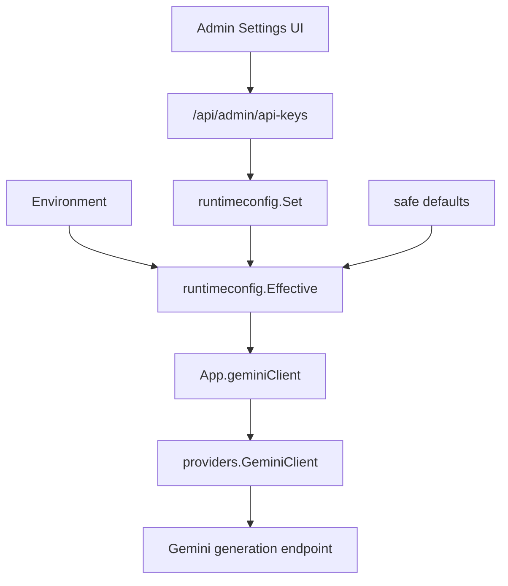
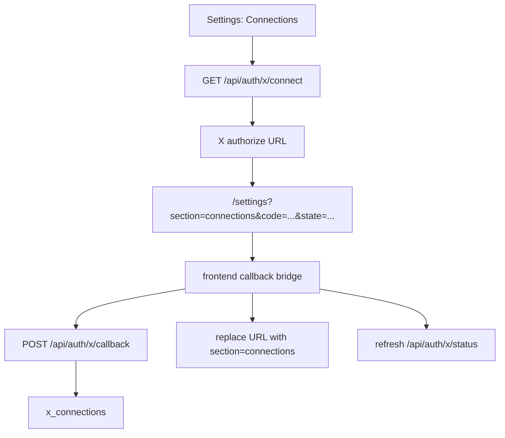
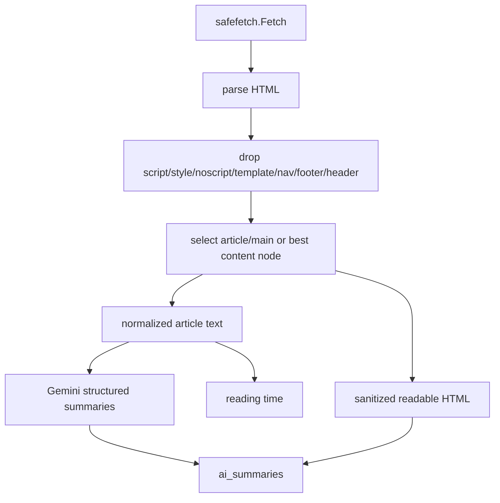

# fix: Restore legacy parity for provider settings, X OAuth, content intelligence, theme, and analytics

## Goal Capsule

The Go port should behave like the working legacy product for the affected core flows:

- Admin Settings must provide the Gemini runtime controls needed by self-hosted deployments without requiring file edits.
- X OAuth must complete after "Authorize App" and return the user to Settings with the account connected.
- Bookmark capture must extract readable article content, compute stable reading time, and generate useful AI summary fields from clean text.
- The embedded UI theme must recover the intentional legacy brutalist identity instead of the current muted drift.
- Analytics must render deterministically with a real empty/error state instead of appearing to load forever.

This is a parity restoration plan, not a redesign or a provider rewrite.

## Debug Summary

### D1. Gemini configuration gap

Legacy and current Go both hard-code the Gemini generation model to `gemini-2.5-flash` and the embedding model to `models/text-embedding-004`. Legacy did not expose model configuration in Admin Settings.

The Go port still has a real self-hosting gap: `providers.GeminiClient` already has a `BaseURL` field, but `runtimeconfig`, env config, `App.geminiClient`, and Admin Settings only carry `gemini_api_key`. If a deployment needs a different Gemini generation model or endpoint, there is no runtime path to set it.

Source evidence:
- Legacy API key UI: `/Users/tbl-gln/TBL/arivu-legacy/frontend/src/components/settings/ApiKeysSection.jsx`
- Legacy AI model selection: `/Users/tbl-gln/TBL/arivu-legacy/backend/app/services/ai_service.py`
- Current runtime keys: `internal/runtimeconfig/runtimeconfig.go`
- Current provider endpoints: `internal/providers/gemini.go`
- Current Admin Settings panel: `internal/app/web/app.js`

### D2. X OAuth callback bridge was lost

Legacy Settings consumed `code` and `state` from `/settings?section=connections`, posted them to `/auth/x/callback`, cleaned the URL, and refreshed connection status.

The Go backend has the connect and callback endpoints, and it stores stronger OAuth state in SQLite. The current embedded frontend starts OAuth but never handles the redirect query params, so the callback is never posted and `x_connections` is never written.

Source evidence:
- Legacy callback bridge: `/Users/tbl-gln/TBL/arivu-legacy/frontend/src/components/settings/ConnectionsSection.jsx`
- Current connect/status UI without callback handling: `internal/app/web/app.js`
- Current backend callback: `internal/app/x.go`

### D3. Content extraction and summaries regressed from article extraction to raw HTML stripping

Legacy fetched HTML, removed obvious chrome, ran readability extraction, converted readable HTML to markdown text, fell back to trafilatura and paragraph extraction, then computed reading time and AI summaries from cleaned article text.

The Go port reads the full response body, stores sanitized full-page HTML, extracts text by toggling inside/outside `<...>` characters, and computes reading time on that noisy text. The sanitizer strips unsupported tags but can preserve child text from script/style-like nodes, so CSS/JS/DOM data can leak into archived reading content.

Legacy also generated multiple AI fields with dedicated prompts over up to 50k characters. Go currently sends up to 12k characters to a one-sentence prompt and writes only `one_sentence`.

Source evidence:
- Legacy extraction pipeline: `/Users/tbl-gln/TBL/arivu-legacy/backend/app/services/content_service.py`
- Legacy AI prompts: `/Users/tbl-gln/TBL/arivu-legacy/backend/app/services/ai_service.py`
- Current fetch/extract: `internal/safefetch/safefetch.go`
- Current sanitizer: `internal/sanitize/sanitize.go`
- Current bookmark processor: `internal/bookmarks/import_export.go`
- Current reading time: `internal/bookmarks/bookmarks.go`

### D4. Theme drifted away from the legacy visual identity

Legacy used a sharp brutalist light theme: Bebas Neue display type, DM Sans body text, IBM Plex Mono labels, near-black borders, signal orange primary actions, electric-blue AI accents, zero radius, and deep black brutal shadows.

The Go port replaced the theme with warm paper, muted brown/teal/gold accents, softer shadows, serif body fallback, OKLCH/color-mix tokens, and smaller visual contrast. That is a token replacement, not a small CSS bug.

Source evidence:
- Legacy theme tokens: `/Users/tbl-gln/TBL/arivu-legacy/frontend/src/index.css`
- Legacy Tailwind theme mapping: `/Users/tbl-gln/TBL/arivu-legacy/frontend/tailwind.config.js`
- Current embedded CSS: `internal/app/web/styles.css`
- Current embedded frontend constraint: `openwiki/architecture/frontend.md`

### D5. Analytics contract and route error state regressed

Legacy `/analytics/summary` returned a combined envelope: `stats`, `topics`, `patterns`, and `insights`. Current Go `/api/analytics/summary` returns only flat counts, and `/api/analytics/reading-stats` is routed to the same flat handler. Current frontend waits on summary/topics/insights before setting route content; if the summary call fails, the router catches only toasts and can leave the user with a loading-looking route.

Source evidence:
- Legacy summary envelope: `/Users/tbl-gln/TBL/arivu-legacy/backend/app/routers/analytics.py`
- Legacy frontend rendering: `/Users/tbl-gln/TBL/arivu-legacy/frontend/src/pages/AnalyticsPage.jsx`
- Current route: `internal/app/web/app.js`
- Current handlers: `internal/app/app.go`
- Current analytics store methods: `internal/bookmarks/bookmarks.go`
- Current golden summary fixture: `internal/app/testdata/golden/analytics_summary.json`

## Product Contract

### Requirements

- R1: Admin Settings exposes Gemini runtime settings required for self-hosted operation: API key, generation model, and provider base URL.
- R2: Gemini settings resolve with the existing precedence model: SQLite runtime setting, then environment, then safe default where applicable.
- R3: X OAuth completes from the browser redirect to Settings by consuming `code` and `state`, posting the existing backend callback, cleaning the URL, and refreshing status.
- R4: Content extraction stores and summarizes cleaned readable article content, not full-page script/style/navigation/chrome text.
- R5: Archived reader HTML excludes script/style/noscript/template content and does not show escaped DOM, JSON, CSS, or bundled JavaScript as article copy.
- R6: Reading time is deterministic and based on cleaned article text.
- R7: AI processing restores structured summary output: one sentence, executive summary or long form, highlights, and suggested tags.
- R8: Analytics renders with empty/error states and does not block the whole page on optional insights.
- R9: Analytics API behavior is made explicitly compatible with either the legacy combined summary envelope or a documented frontend-only contract. Prefer legacy compatibility unless implementation proves it is meaningfully riskier.
- R10: The visual theme returns to the legacy brutalist identity while remaining dependency-free and embedded.

### Scope Boundaries

- Do not reintroduce the legacy React/Tailwind build.
- Do not add a multi-provider AI abstraction; keep this Gemini-focused.
- Do not silently mutate reverse proxy, firewall, or shared-VPS behavior.
- Do not make X credentials mandatory for app startup.
- Do not rely on remote font imports in the embedded frontend. If font files are not vendored, use strong local fallback stacks that preserve the same hierarchy.
- Do not block Analytics on Gemini insights.

## Planning Contract

### Key Technical Decisions

- KTD1: Extend the existing runtime configuration path instead of creating a second Admin Settings store.
- KTD2: Add separate provider fields only where there is clear operational value: `gemini_model` for generation and `gemini_base_url` for self-hosted/proxy deployments. Keep the embedding model fixed unless current deployment errors prove it needs the same treatment.
- KTD3: Restore X OAuth using the legacy frontend bridge pattern because the backend callback already exists and the X redirect URI is already `/settings?section=connections`.
- KTD4: Fix article extraction in `internal/safefetch` and `internal/sanitize`, so import jobs, summaries, read time, reader display, and future callers share one cleaned content path.
- KTD5: Keep extraction dependency-free. Use `golang.org/x/net/html`, scoring heuristics, article/main selectors, and robust fallbacks before considering new parser libraries.
- KTD6: Make Analytics progressively render core stats first, then optional topics/insights, with explicit empty/error UI.
- KTD7: Treat theme restoration as token/component parity, not a new design exploration.

### Implementation Order

1. X OAuth callback bridge.
2. Analytics contract and route error handling.
3. Content extraction, sanitizer, reading time, and AI summary quality.
4. Gemini model/base URL runtime settings.
5. Theme parity pass and browser smoke checks.
6. Documentation, changelog, and final verification.

The first two units unblock obvious broken pages with low blast radius. The content and summary unit is the highest product-risk area and should be tested before visual work.

## Technical Design

### Runtime Provider Settings



### X OAuth Flow



### Content Processing Flow



## Implementation Units

### U1. Repair X OAuth Browser Completion

Files:
- `internal/app/web/app.js`
- `internal/app/x.go`
- `internal/app/app_test.go`

Steps:
1. Add a small Settings/Connections callback helper that reads `code`, `state`, and `section` from `window.location.search`.
2. If both `code` and `state` exist, show a connecting state, call `POST /api/auth/x/callback`, clean the URL back to `/settings?section=connections`, then refresh status.
3. Ensure callback failures render an actionable message in the Connections panel, not only a transient toast.
4. Revisit the `api()` auth-refresh skip for `/auth/*`; allow refresh for authenticated callback/status calls if this does not weaken CSRF or audience checks.

Tests:
- Frontend mocked-fetch test for `/settings?section=connections&code=c&state=s`.
- Go callback test keeps existing backend behavior covered: valid state writes `x_connections`; expired or mismatched state fails closed.
- Browser smoke: start connect, simulate the redirect, verify connected status appears.

### U2. Fix Analytics Contract and Route Resilience

Files:
- `internal/app/app.go`
- `internal/bookmarks/bookmarks.go`
- `internal/app/web/app.js`
- `internal/app/testdata/golden/analytics_summary.json`
- `internal/app/golden_test.go`

Steps:
1. Restore `/api/analytics/summary` as a legacy-compatible envelope: `stats`, `topics`, `patterns`, `insights`.
2. Implement `/api/analytics/reading-stats` as reading stats, not an alias to flat summary counts.
3. Keep split endpoints (`topics`, `patterns`, `insights`) for current UI reuse.
4. Change the frontend so core stats render even if optional topics or insights fail.
5. Add a route-level empty/error state that replaces page content when summary fails.
6. Ensure Gemini-backed insights have a timeout/fallback that cannot indefinitely block first render.

Tests:
- Golden fixture for combined summary shape.
- Handler tests for summary, reading stats, topics, patterns, and insights.
- Frontend mocked-fetch test where insights fails and stats still render.
- Frontend mocked-fetch test where summary fails and the route shows an error state.

### U3. Restore Article Extraction, Sanitization, and Reading Time

Files:
- `internal/safefetch/safefetch.go`
- `internal/safefetch/safefetch_test.go`
- `internal/sanitize/sanitize.go`
- `internal/sanitize/sanitize_test.go`
- `internal/bookmarks/bookmarks.go`
- `internal/bookmarks/import_export.go`
- `internal/bookmarks/import_export_test.go`

Steps:
1. Replace `ExtractText`'s tag-state-machine with HTML parsing.
2. Drop non-content nodes before both text extraction and sanitized HTML generation: `script`, `style`, `noscript`, `template`, `svg`, `canvas`, obvious nav/header/footer/aside chrome, and known JSON data nodes.
3. Prefer `<article>`, `<main>`, or the highest-scoring content subtree by paragraph/link density.
4. Normalize whitespace and decode entities before storing text.
5. Use cleaned article text for `readingTime`.
6. Store readable article HTML, not full-page HTML, after backend sanitization.
7. Add conservative fallbacks for short pages: paragraph extraction, then body text as a last resort.

Tests:
- Fixture with nav/footer/script/style/`__NEXT_DATA__` and one article: extracted text contains article copy and excludes chrome/code.
- Fixture with HTML entities: stored text is human-readable.
- Sanitizer test proves script/style child text is dropped.
- Import processor test proves read time uses cleaned article words only.

### U4. Restore Structured AI Summary Quality

Files:
- `internal/providers/gemini.go`
- `internal/providers/gemini_test.go`
- `internal/bookmarks/import_export.go`
- `internal/bookmarks/import_export_test.go`
- `internal/bookmarks/bookmarks.go`

Steps:
1. Replace the one-sentence-only prompt with structured summary prompts or one structured JSON prompt.
2. Generate and store at least:
   - `one_sentence`
   - `long_form` or executive summary
   - `highlights`
   - `suggested_tags`
3. Increase summary input limit from the current 12k characters toward legacy's 50k-character behavior, with a clear cap to control cost.
4. Keep local fallback summary behavior for unconfigured Gemini, but do not mark a noisy or failed provider response as a high-quality AI summary.
5. Preserve provider failure details in processing status or audit logs without leaking secrets.

Tests:
- Fake Gemini response populates all expected fields.
- Provider failure records a failed or fallback status with a readable user-facing message.
- Summary prompt receives cleaned article text, not raw full-page HTML.

### U5. Add Gemini Model and Base URL Runtime Settings

Files:
- `internal/runtimeconfig/runtimeconfig.go`
- `internal/runtimeconfig/runtimeconfig_test.go`
- `internal/config/config.go`
- `internal/providers/gemini.go`
- `internal/providers/gemini_test.go`
- `internal/app/app.go`
- `internal/app/admin.go`
- `internal/app/web/app.js`
- `openwiki/architecture/runtime.md`
- `openwiki/operations/deployment.md`

Steps:
1. Add runtime keys and env mappings for `gemini_model` and `gemini_base_url`.
2. Default generation model to the current model, `gemini-2.5-flash`.
3. Validate base URL as HTTPS unless explicitly running a local/test endpoint.
4. Pass the effective values through `App.geminiClient`.
5. Make `providers.GeminiClient.endpoint()` use the configured model and base URL.
6. Add Admin Settings inputs near the Gemini API key.
7. Keep blank-secret preservation behavior for API keys.

Tests:
- Runtime precedence test: SQLite override beats env, env beats default.
- Admin handler test persists and deletes model/base URL values correctly.
- Provider test with `httptest.Server` proves requests use configured base URL and model path.
- UI source test or browser smoke proves the Admin Settings fields are visible and saved.

### U6. Restore Theme Parity

Files:
- `internal/app/web/styles.css`
- `internal/app/web/index.html`
- `openwiki/architecture/frontend-runtime.md`

Steps:
1. Rebuild CSS variables around the legacy identity: near-white background, black ink, signal orange primary, electric-blue AI accent, sharp radii, and deeper brutal shadows.
2. Replace current muted brown/teal/gold dominance with the legacy action/accent hierarchy.
3. Reset native controls to `border-radius: 0` unless a component has a deliberate exception.
4. Use embedded-safe font stacks that approximate legacy roles:
   - condensed display for logo/major headings
   - clean sans for body and UI
   - mono for overlines, counters, and badges
5. Avoid remote font imports unless font files are vendored into the embedded asset tree.
6. Remove or reduce OKLCH/color-mix dependency where unsupported browser behavior would drop critical colors.

Tests:
- Browser screenshots at desktop and `390x844` for `/auth`, `/dashboard`, `/settings`, `/analytics`, and at least one bookmark detail route.
- Check nav active state, primary buttons, cards, inputs, badges, shadows, and text overflow.
- Run `node --check internal/app/web/app.js` and `node --check internal/app/web/sw.js`.

### U7. Documentation, Changelog, and Release Notes

Files:
- `CHANGELOG.md`
- `openwiki/domain/bookmarks-sync.md`
- `openwiki/architecture/runtime.md`
- `openwiki/architecture/frontend-runtime.md`
- `openwiki/operations/deployment.md`
- `openwiki/testing/tactics.md`

Steps:
1. Document new Gemini runtime settings and their precedence.
2. Document X OAuth callback behavior and the required redirect URI.
3. Document the cleaned article extraction pipeline.
4. Document analytics API shape and frontend fallback behavior.
5. Update smoke-test guidance for theme and route checks.
6. Add a changelog entry for the user-visible fixes.

## Verification Contract

Run these before handoff:

```bash
gofmt -w internal/runtimeconfig internal/config internal/providers internal/app internal/bookmarks internal/safefetch internal/sanitize
GOCACHE=/private/tmp/arivu-build-cache go test ./...
node --check internal/app/web/app.js
node --check internal/app/web/sw.js
node extension/url-utils.test.mjs
node extension/content.test.mjs
go build -trimpath -ldflags="-s -w" -o /private/tmp/arivu-verify ./cmd/arivu
```

Manual/browser smoke:

- Start a local server with a disposable SQLite database and an admin user.
- Visit `/settings?section=api-keys`; confirm Gemini key, model, and base URL can be saved and reloaded.
- Visit `/settings?section=connections&code=fake&state=fake` with mocked backend/fake X flow; confirm callback handling, URL cleanup, and status refresh.
- Import or save a fixture article containing nav, style, script, JSON data, and readable article text; confirm reader display, read time, and summary fields.
- Visit `/analytics` with no bookmarks, with fixture bookmarks, and with forced insights failure; confirm no endless loading state.
- Capture desktop and mobile screenshots for the routes listed in U6.

## Definition of Done

- X connection completes after X redirects back to Settings.
- Admin Settings supports the Gemini runtime controls needed for the deployment errors reported by the user.
- Saved bookmark content no longer contains random DOM/HTML/script/style text.
- Reading time is stable and based on article text.
- AI summary fields are useful and populated from cleaned content.
- Analytics renders either data, empty state, or an actionable error state within a bounded time.
- The UI visibly returns to the legacy Arivu brutalist theme while staying dependency-free.
- Relevant OpenWiki pages and `CHANGELOG.md` are updated.
- Verification commands pass, or any failures are documented with exact residual risk.

## Open Questions

- Which deployment error requires Gemini configurability: model name, base URL, API key persistence, or a provider response failure? U5 covers model/base URL, but implementation should confirm the exact production error before adding more knobs.
- Should failed Gemini summary processing show a failed status to the user, or keep a local fallback as completed with a provider warning? The legacy behavior marked hard retry exhaustion as failed.
- Should the Go analytics summary fully preserve the legacy envelope or should the UI adopt a smaller documented contract? This plan recommends preserving the legacy envelope for least surprise.

## Review Notes

- Investigation used the current Go repo plus `/Users/tbl-gln/TBL/arivu-legacy`.
- No code behavior was changed while preparing this plan.
- Subagent findings were used for Admin/Gemini, X OAuth, content processing, theme, and Analytics in parallel.
